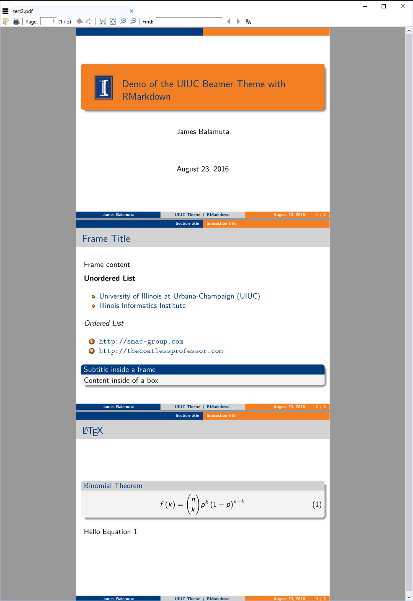
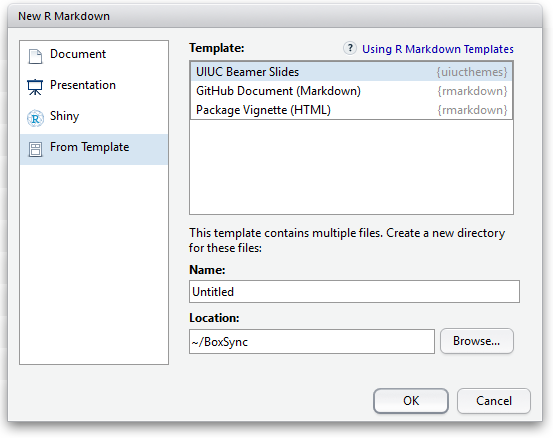

# UIUC Themes for R Markdown (`uiucthemes`)

The **uiucthemes** package includes my collection of UIUC themed templates.

Presently, only the UIUC Beamer Theme is embedded within the package.

## UIUC Beamer Theme - Example

Within an `RMarkdown` file, add the following:

```yaml
---
title: "Demo of the UIUC Beamer Theme with RMarkdown"
shorttitle: "UIUC Theme + RMarkdown"
author: "James Balamuta"
institution: "University of Illinois at Urbana-Champaign"
date: "August 23, 2016"
section-titles: false
output: 
   uiucthemes::uiuc_beamer
---

# Section title     
## Subsection title 

### Frame Title

Frame content 

**Unordered List**

- [University of Illinois at Urbana-Champaign (UIUC)](http://illinois.edu)
- [Illinois Informatics Institute](http://www.informatics.illinois.edu/)

*Ordered List*

1. <http://smac-group.com>
2. <http://thecoatlessprofessor.com>


#### Subtitle inside a frame

Content inside of a box 

### \LaTeX

\begin{exampleblock}{Binomial Theorem}
\begin{equation} 
  f\left(k\right) = \binom{n}{k} p^k\left(1-p\right)^{n-k}
  \label{eq:binom}
\end{equation} 
\end{exampleblock}

Hello Equation \ref{eq:binom}
```

This generates:





## Materials Referenced

- [Custom Document Templates](http://rmarkdown.rstudio.com/developer_document_templates.html) / [Custom Formats](http://rmarkdown.rstudio.com/developer_custom_formats.html)
- [Beamer Presentation Format](http://rmarkdown.rstudio.com/beamer_presentation_format.html)
- [Beamer Pandoc Template](https://github.com/jgm/pandoc-templates/blob/master/default.beamer)
- [`rticles` An R Package](https://github.com/rstudio/rticles)

### Prerequisites

- LaTeX Distribution
   - Windows: <http://http://miktex.org/download>
   - Mac: <http://tug.org/mactex/mactex-download.html>
   
### Using `uiucthemes` from RStudio

To use **uiucthemes** from RStudio:

1) Install the latest [RStudio](http://www.rstudio.com/products/rstudio/download/).

2) Install the **uiucthemes** package: 

```r
install.packages("devtools")
devtools::install_github("coatless/uiucthemes")
```

3) Use the **New R Markdown** dialog to create an article from one of the templates:


    
    
### Using `uiucthemes` outside of RStudio

1) Install [pandoc](http://johnmacfarlane.net/pandoc/) using the [instructions for your platform](https://github.com/rstudio/rmarkdown/blob/master/PANDOC.md).

2) Install the **rmarkdown** and **uiucthemes** packages:

```r
install.packages("rmarkdown")
devtools::install_github("coatless/uiucthemes")
```
    
3) Use the `rmarkdown::draft` function to create articles:

```r
rmarkdown::draft("slide_deck.Rmd", template = "uiuc_beamer", package = "uiucthemes")
```

